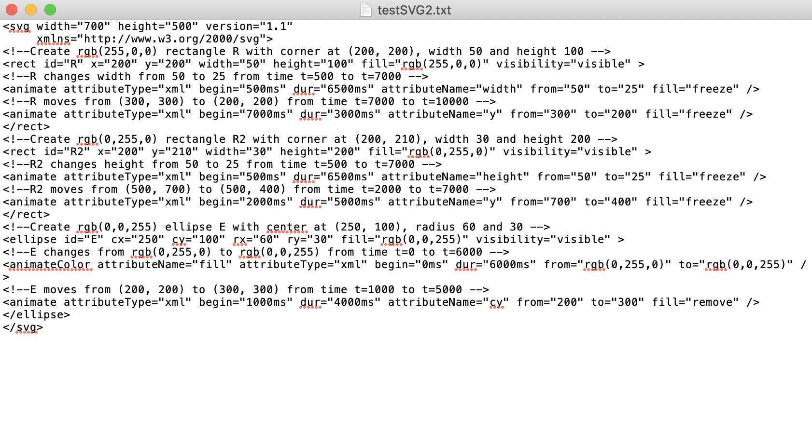
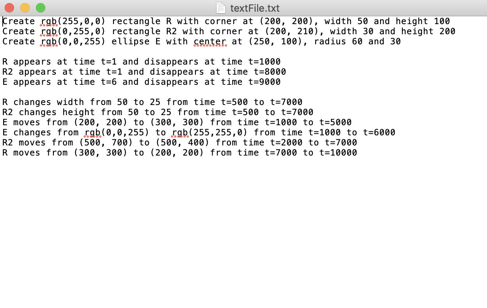
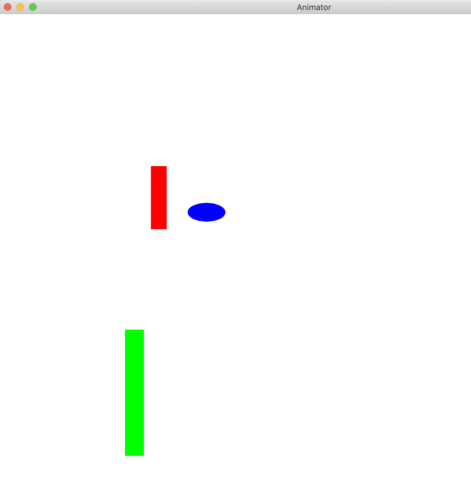
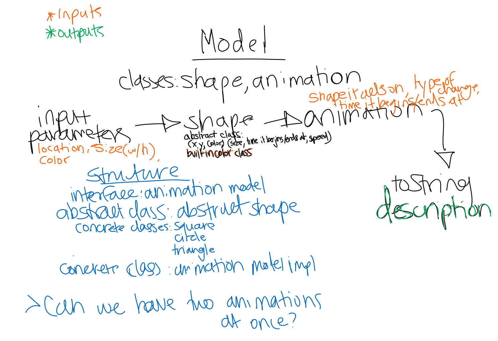
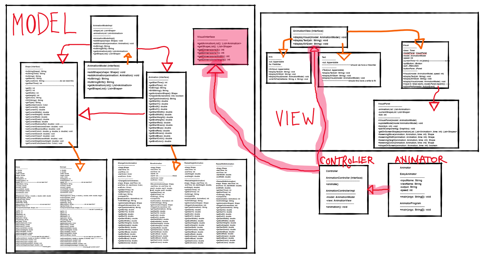
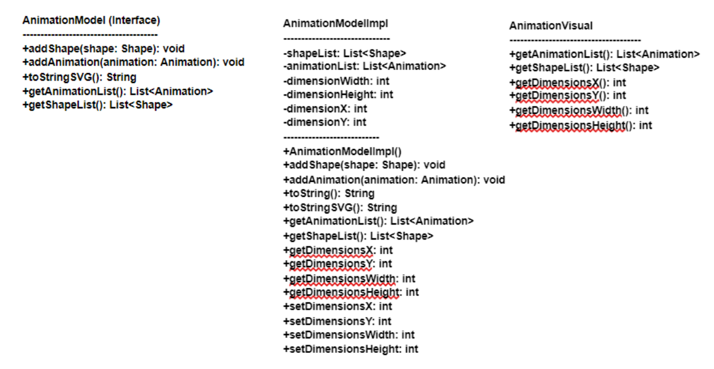
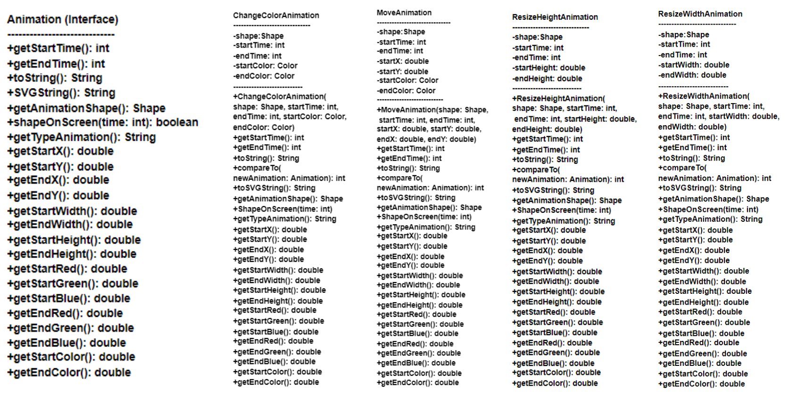
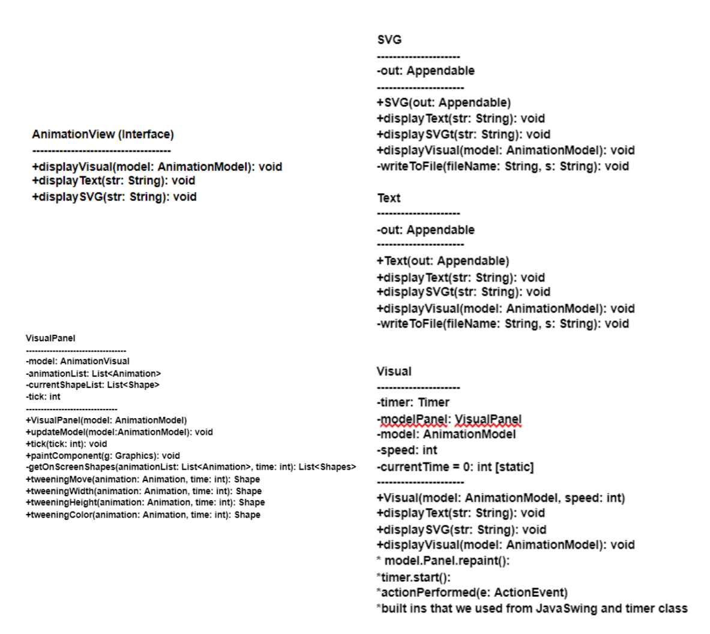
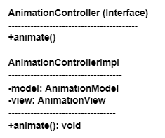
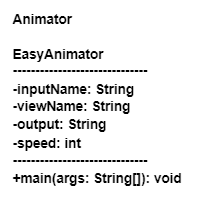

# 5004Project
5004 Animation Project-- Sommer and Katie

Welcome to our readme! Please read this file for more information about our submission for the final project for CS5004, at Northeastern Khoury College of computer science. This project was to build an MVC model that created an animation through textual and visual outputs. Our code can read from a command line prompt and read in from a file, create text descriptions of an animation both in a file or in the console, create SVG descriptions of an animation in a file or in a console, and create a graphical user interface that displays our animation.

# README CONTENTS:
1. USING OUR VIEWS
2. OUR FILES AND DESIGN
3. DESIGN CHOICES AND SOLID PRINCIPLES
4. AREAS FOR IMPROVEMENT

# 1. USING OUR VIEWS:
1. To test our SVG view, we used the following link: https://www.freecodeformat.com/svg-editor.php. We copy and pasted the SVG output from our console or a file we printed to into this browswer.
To recieve the code from the Java console, run configurations for easyAnimator, and in the program argument, paste: "-in model -view SVG" (without the quotation marks). To recieve the code by saving to a text file, run configurations for easyAnimator, and in the program argument, paste: "-in model -view SVG -out testSVG2.txt".

2. To test our text view, we can get a text output from our Java console or printed to a text file.
To recieve the code from the Java console, run configurations for easyAnimator, and in the program argument, paste: "-in model -view Text"
To recieve the code by saving to a text file, run configurations for easyAnimator, and in the program argument, paste: "-in model -view Text -out textFile.txt"

3. To test our visual view, run configurations for easyAnimator, and in the program argument, paste: "-in model -view Visual"

When we inputted the command to animate buildings.txt, we were able to make some progress, shown below. However, given that this was a rather complex animation, our program does not yet read it with 100% accurracy. This issue was likely caused by the background being painted in blue after the black that was painted on. Our code did not initially account for an animation with some complexity. However, it does work for simpler examples. 

# 2. OUR FILES AND DESIGN:
The Diagram below outlines our program's overview design.

We will now explore our design choices that let to this final diagram.

Our initial diagram was just at the model, where we began this project, and was not very sophisticated. It took us a bit of time to figure out that we were going to represent shapes and animations as objects in lists, similar to how we had lists of nodes in the sentence lab and polynomial list assignments. Our first brainstorm and diagram looked like:

The diagram below represents the MVC with sloppy interconnections between the view, model, and controller. At this point in the process, we did not follow the principle of having one class or interface in the model that was meant to interact with the controller. Rather, we called methods from both shape and animation classes when we needed them. Within the model, view, and controller, the red lines represent when a class is used by another. The orange lines represent the relationship between an interface and a class that extends it. There are several errors on this diagram, and though it looks relatively neat, it had poor MVC design overall, because we were calling methods in the view from multiple classes in the model. The image below highlights the poor MVC design by using black arrows to show where information is shared between multiple classes in the model and view and controller, rather than just having one interface in the model that shares information with the controller and view.

We fixed our MVC design flaw by adding another interface in the model that we called our AnimationVisual. This interface has getters for the relevant information we needed for our view. With this new interface, we now do not need to pass the model into our view, and risk exposing methods that might alter something in our model. We will note here that we also call many getters for shapes and animations in the model, but these do not compromise our MVC design, as they are like calling toStrings, which are common to all components of the MVC. When we were redesigning our MVC, we wanted to be sure that we were not passing the actual model object to the view. We noted that it would be alright to pass a clone of the model or some adaptor form of the model that would allow us to get the information we needed without exposing any internal model changing methods.

Here is our updated MVC structure. This image is meant to highlight (in pink) our VisualInterface, and show how it minimizes the number of model classes that interact with other parts of the MVC. Note how the controller can just interact with this part of the model to give it to the view:

# Model Files:
In our model, we have an interface for our animation model. We also have an implementation. This implementation holds our shape and animation objects in lists and builds strings out of them. AnimationModelImpl implements our AnimationModel and AnimationVisual Interfaces. See our AnimationModel, AnimationModelImpl, and VisualInterface below:

See our shape interface and concrete classes (ChangeColorAnimation, MoveAnimation, ResizeWidthAnimation, and ResizeHeightAnimation) that implement it below:

See our animation interface and concrete classes (Ellipse and Rectangle) that implement it below:

# View Files:
Our view has an interface and three concrete classes (text, visual, and SVG) that implement it. We also have a VisualPanel where we create our GUI. See these components below:

# Controller Files:
Our controller has an AnimationControllerInterface and an AnimationControllerImpl:

# Main Files:
Our main has our easy animator, which basically is a space to call our controller. 

In a separate Package, Java Util, we also have AnimationBuilder, AnimationReader, and AnimationBuilder2, which assist in parsing text from a file as input and turning it into an animation using our program.

# 3. DESIGN CHOICES AND SOLID PRINCIPLES:

As we built this project, we aimed to adhere to the SOLID design principles:
>1. The Single Responsibility Principle - the idea that classes should only have one responsibility

>2. The OpenClosed Principle - the idea that classes should be available for extension, but closed to modifications

>3. The Liskov Substitution Principle - Our subclasses can do everything that our base class can.

>4. The Interface Segregation Principle - create smaller, more cohesive interfaces so we don't depend on methods we don't need: viewmodel interface 

>5. The Dependency Principle - details depend on abstractions and high level modules depend on abstractions rather than low level modules 

In the initial stages, we manually implemented lists for animations and shapes and were keeping track of these lists in our animation and shape classes. We actually followed a similar format as the original words in a sentence lab and created these lists with nodes. We had a shape list where each node had a shape, and the list started with an empty node that contained no shape, but acted as a placeholder. We approached the animation list in the same way, with an empty placeholder animation at the beginning of the list to act as an empty list. This approach to making lists made the most sense to us as we started out, but ultimately led to some problems. We decided to restructure our lists and use higher order list functions. This redesign allowed us to follow better coding practices because it decoupled our code. Initially, our animation classes and shape classes were keeping track of the lists of shapes and animations AND the individual shape and animation objects. When we used a built in list array, our implementation model was responsible for keeping track of the lists of animation and shape objects while our animation and shape classes could jut keep track of the objects themselves. This effectively decoupled some of our code.

We initially had an abstract class for shape, but then decided to use concrete classes that implemented an interface, because the main methods in these classes were tostrings, which would be different from one another anyway, depending on the shape. Looking back on this decision now that we have created the rest of the MVC, it may have been a good idea to leave the abstract classes in there. We initially thought it would just be writing unnecessary code, since we could just include the common methods in interfaces. However, when we created the rest of the MVC, we did end up adding in methods that were the same for both of our shapes and for all of our animations. In this case, an abstract class would have been good to lead to less code duplication, making debugging easier. This issue came up when we were debugging our resizeHeightAnimation(). Our resizeWidthAnimation() was working but our resizeHeightAnimation() was not working. If we had keps abstract classes for both animantions and shapes, we would have better adhered to the dependency principle.

We initially had methods in our AnimationModelImpl for adding the different kinds of animations. We changed this to one method: addAnimation(). While this is not the same as an abstract shape, it does help with adherence to the dependency principle, because we created a method that focuses on adding animations, as referenced by the animation interface, rather than creating separate methods for individual types of animations. Thus we depend on the higher order representation of our animations rather than the detailed instantiations of our animations as much as possible.

As we were creating the visual view, we added an entire new set of fields to our shapes in the model: current color, current height, current width, current x and current y. These fields reflected the values that we produced from tweening in our visual view. Creating these fields is on the edge of potentially violating the OpenClosed principle. On one hand, we were adding new fields to an object that was already created, and thus changing the model. However, we didn't alter any of the initial code that we first created when we added these variables, we simply added more code. We did simply extend the code by adding to it rather than changing it, which was good, but it was risky in the sense that we did modify(only by adding to) classes we had already created. This extension could have been made purer by creating a new class whose sole purpose was to store the current states and qualities of the shapes.

We adhere to the Interface Segregation Principle in our creation of the viewModel interface. As we illustrates above, after creating most of the MVC, we had added many getters for the various states and times in our animations. These allowed us to pull this information when we were tweening and put it into our list of shapes that we would then animate using java swing. However, this also led to a messy overall structure in that several of our classes were sending information out of the model. We solved this problem and adhered to the Interface Segregation Principle by creating our viewModel interface to store all of our getters. This is like an adaptor to share information with the rest of our MVC without exposing any methods that could potentially modify our Model.

The Liskov Substitution Principle applies to our creation of ellipses and rectangles as subclasses of shapes. Because our rectangles and ellipses can do everything that the shape interface can, this structure follows the Liskov Substitution Principle. If we were to add a square shape to our code, we could theoretically add it as a subclass of the rectangle, and this would adhere to the Liskov Substitution Principle, because a square can do everything a rectangle can do. However, it would risk not adhering to the Dependency Principle, because then we would have a shape unnecessarily depending on a rectangle object when it could just as easily be just a subclass of shape, and then would have more flexibility.

# 4. AREAS FOR IMPROVEMENT:
>Add in buttons: start, pause, rewind, resume, and restart to graphical view.

>Add in enable/diable looping for graphical view.

>Ability for the user to increase or decrease the speed of the animation in the graphical view.

>Create .JAR extension file to run our program.

>Add in keyboard and mouse listening functionality.

>Reduce replication in our code.

>Revise our Javadocs to be even more precise in their description of the functionality.

>More thorough testing.

>Create the ability to add in and delete shapes from the garphical view.

>Allow the user to save and load their work and interaction with the animation.

>Make our GUI more friendly and intuitive without the user needing to read our documentation or Javadocs.

>Provide better visual cues about what input is expected and what input the user has provided.

# Additional Notes:

We did consider making the rule that shape coordinates must be in the frame and that their width and height must be smaller than the frame. We then decided against this because it could limit what is possible to draw with shapes. For example, if someone wanted to draw a yellow sun in the corner of the frame they might want the center of their shape to be out of the frame.

During the development of our code, we did so much experimentation and testing with JavaSwing, that we decided to put it in its own class: VisualPanel. One way to improve our code would be to move all the functionality back to the VisualView.

When we were fixing our JavaStyle with feedback from bottlenose, there was one curly brace issue in the AnimationModelImpl that had been giving us some grief. We know theoretically we should be able to just add curly braces around the argument following the if statement, but were getting some unknown errors when trying to alter it, so decided to leave it in.

We also recieved some suggestions to make many of our singular fields local variables since they were used infrequently. However, many of these variables were involved with complicated list traversals, so we decided to leave them for now, until we understand our program better.

The suggestion also came up to make our timer a local variable but we had had so many issues with getting our timer to run correctly that we opted to leave it how it was. The roles of local and global variables are a great point of exploration for future learning opportunities.

